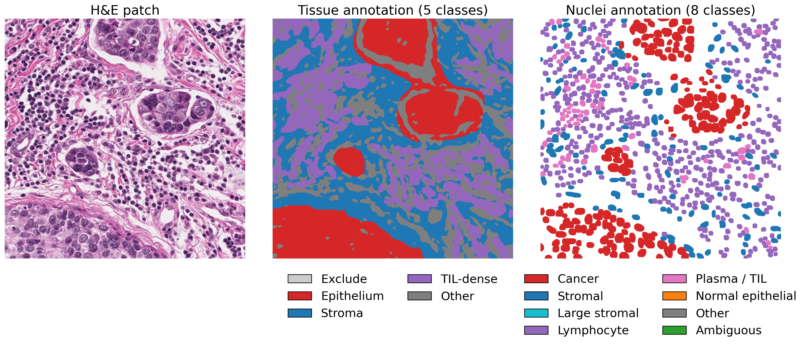
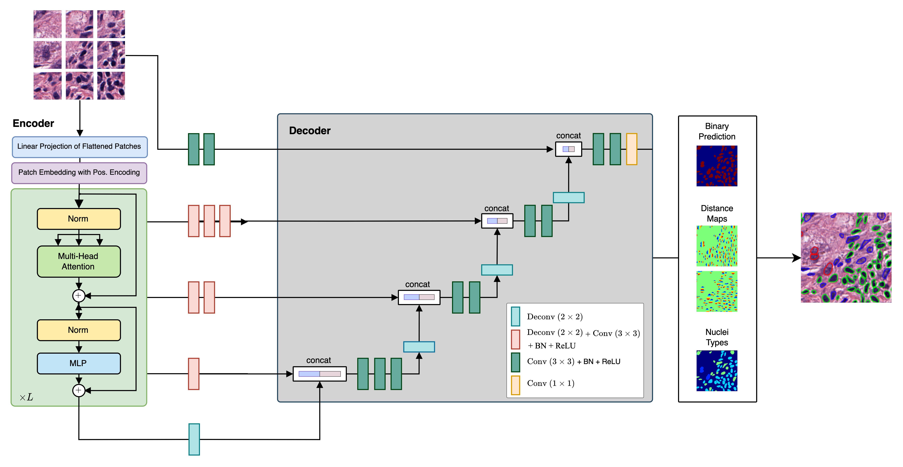
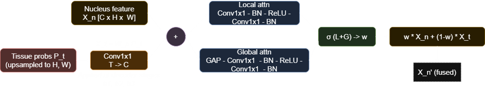
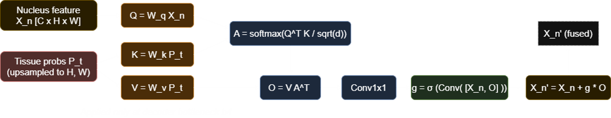
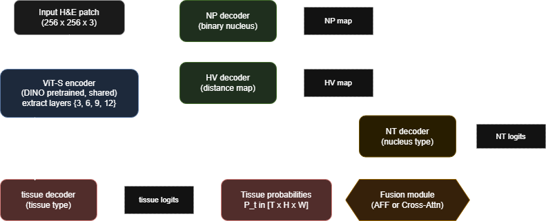
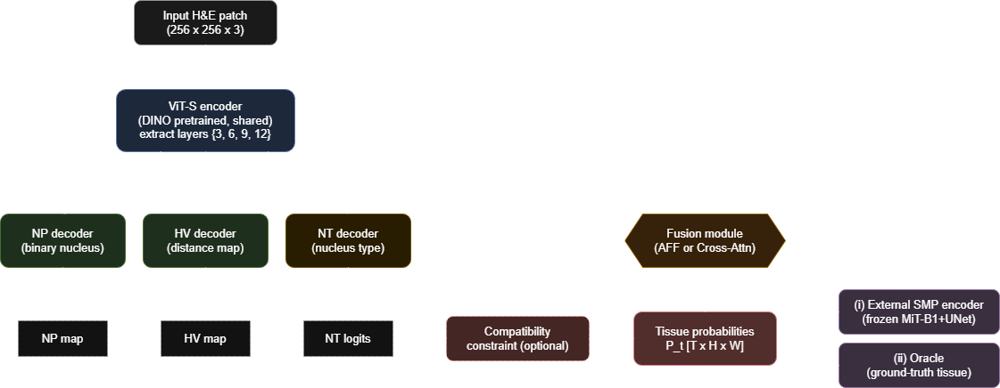

# Tissue-Aware CellViT: Nucleus Segmentation and Classification with Tissue Context Fusion


> The [CellViT](https://github.com/TIO-IKIM/CellViT) extension for classifying cell nuclei in histological images of breast cancer, utilising the context of the surrounding tissue via attention-based fusion. Created as a Bachelor's thesis in FIIT STU

## Motivation 

Histopathological whole-slide image analysis plays a crucial role in modern medical diagnostics, as microscopic tissue structures contain essential information for disease identification and treatment planning. One of the key tasks in this domain is the segmentation and classification of cell nuclei. To enhance the model understanding of these small objects, tissue context was utilized, enabling the model to capture knowledge of the surrounding environment and to consider the biological compatibility of nuclei with specific tissue types

## Dataset



For this study, the [PanopTILs dataset](https://sites.google.com/view/panoptils) was used, which was compiled from The Cancer Genome Atlas (TCGA). The dataset contains H&E-stained whole-slide images of breast cancer, including the existing NuCLS dataset, which annotated nuclei, and the BCSS dataset, which annotated tissues on the same WSI. Therefore, PanopTILs provides pixel-level annotations for both nuclei and tissue regions

## Baseline



The [CellViT](https://github.com/TIO-IKIM/CellViT) architecture was selected as the baseline model, which consists of a shared Vision Transformer encoder pretrained with DINO self-supervised learning and a multi-branch decoder from the HoVer-Net approach. The decoder has three branches: 
- NP - nuclei prediction, capture boundaries by producing the binary segmentation
- HV - horizontal-vertical predictions, generates horizontal and vertical distance maps for more precise instance separation
- NT - nuclei type map, classifying each nucleus. Skip connections from encoder layers are passed to all three decoders. 

The encoder is frozen for the first 25 epochs to stabilize early training

## Implemented Extensions 

### Attentional Feature Fusion (AFF)



One of the mechanisms implemented is Attentional Feature Fusion (AFF). The AFF block computes a soft per-channel blending weight between the nucleus feature map and a projected tissue representation. 

The tissue probabilities are first projected to match the nuclei feature dimension with a learned 1x1 convolution. Next, we sum the features and pass them through local and global attention. Adding them together and passing them through the sigmoid function yields blending weights, a map of blending coefficients, with each pixel assigned its own weight, indicating how important it is to consider.

This block is applied at three decoder stages except the bottleneck

### Cross-attention bottleneck



Another method applies cross-attention at the decoder bottleneck stage. Nucleus features serve as queries and tissue probabilities as keys and values. 

First, all features are projected onto a single embedded space. By multiplying queries and keys, we compute the similarity between each q-token and all k-tokens, which indicates how closely each nuclei pixel is related to each tissue pixel. The scale is applied to keep the distribution within the working range. Running this through Softmax gives us the attention probabilities.

By applying the values, each nuclear pixel receives a weighted sum of information from the tissue. The attention output is projected back to the nuclei dimension and gated, which makes one general map of confidence probabilities, a scalar gate that controls the magnitude of the residual attention correction.

The output projection is zero-initialized, ensuring the module has no effect at the start of training, so as not to interfere with the training of the entire model

### Tissue sources

Three configurations for feeding P_t to the fusion module were implemented using different architectures. One version had an embedded architecture, and the other two had an external architecture

**Decoder Branch** 



An additional decoder specifically for tissue segmentation was added to the multi-branch decoder in the CellViT model. Using the single ViT-S encoder, it was trained jointly with the nucleus heads. The tissue branch is supervised by a weighted combination of Focal-Tversky, Dice, and cross-entropy losses

**External sources**



*Frozen SMP encoder*

As the separate encoder was chosen MiT-B1 with a U-Net-style decoder from the segmentation-models-pytorch library. The training was conducted in two phases. In the first, the encoder was pretrained on the same patches for tissue segmentation only. In the second phase, the tissue encoder was frozen, and the model was trained only receiving features through it

*Oracle tissue*

The ground-truth tissue mask, retrieved directly from the dataset, is one-hot encoded and fed directly to the fusion module at both training and inference. This configuration serves as an upper bound, quantifying the maximum gain a perfect tissue branch could provide

### Compatibility Constraint

One of the advantages of working with nuclei and tissue simultaneously is that not all types of nuclei and tissues are biologically compatible, and this information can be applied to training. For this task, a learnable kernel, masked by a fixed binary admissibility matrix encoding prior biological knowledge, produces a per-nucleus-class scaling factor from the tissue probabilities. This scale is gated by the nucleus foreground probability and applied multiplicatively to the nucleus logits, suppressing biologically implausible nucleus-tissue combinations

## Results

Learnable tissue variants were evaluated on a single fold due to computational constraints. Oracle and baseline configurations were evaluated with 5-fold cross-validation and on a held-out test set

### Ablation: Learnable Tissue Sources

| Model | mPQ | cls_f1 | bPQ | Tissue Dice |
|-------|-----|--------|-----|-------------|
| Baseline | 0.254 | 0.324 | 0.660 | - |
| Tissue Decoder AFF | 0.249 | 0.327 | 0.657 | 0.196 |
| Tissue Decoder Cross-Attn | 0.234 | 0.316 | 0.638 | 0.198 |
| SMP AFF | 0.250 | 0.320 | 0.647 | 0.692 |
| SMP Cross-Attn | 0.247 | 0.323 | 0.644 | 0.692 |

None of the learnable tissue variants improved nucleus classification over the baseline. Even SMP variants that reached Tissue Dice 0.692 showed no benefit when fused with the nuclei branch.

### 5-Fold Cross-Validation

| Model | mPQ | cls_f1 | bPQ | F1_d | AUROC |
|-------|-----|--------|-----|------|-------|
| Baseline | 0.249 ± 0.004 | 0.328 ± 0.009 | 0.586 ± 0.041 | 0.757 ± 0.046 | 0.908 ± 0.007 |
| Oracle AFF | **0.366 ± 0.022** | **0.485 ± 0.023** | 0.583 ± 0.041 | 0.756 ± 0.046 | **0.960 ± 0.007** |
| Oracle Cross-Attn | 0.269 ± 0.017 | 0.356 ± 0.017 | 0.583 ± 0.042 | 0.756 ± 0.046 | 0.936 ± 0.010 |
| Oracle AFF + Constraint | 0.351 ± 0.021 | 0.466 ± 0.026 | 0.585 ± 0.041 | 0.757 ± 0.046 | 0.925 ± 0.024 |

Oracle AFF yields the largest gains: mPQ +47% and cls_f1 +48% over baseline. Detection metrics (bPQ, F1_d) remain stable across all configurations, indicating that tissue context improves nucleus type classification without affecting instance localization

### Test Set

| Model | mPQ | cls_f1 | bPQ | F1_d | AUROC |
|-------|-----|--------|-----|------|-------|
| Baseline | 0.252 | 0.322 | 0.616 | 0.788 | 0.909 |
| Oracle AFF | **0.353** | **0.454** | 0.606 | 0.785 | **0.952** |
| Oracle Cross-Attn | 0.272 | 0.350 | 0.617 | 0.790 | 0.948 |
| Oracle AFF + Constraint | 0.351 | 0.454 | 0.613 | 0.789 | 0.932 |

Test set results are consistent with cross-validation. Oracle AFF remains the strongest configuration

## Summary 

This work investigated the integration of tissue context into CellViT for nucleus type classification in H&E-stained histological images. Two fusion mechanisms were implemented and evaluated with different tissue sources: a jointly trained auxiliary tissue decoder, a frozen pretrained external tissue encoder, and an oracle providing ground-truth tissue maps.

The results show that models with learnable tissue encoders do not improve over the tissue-blind baseline, regardless of the tissue segmentation quality or the fusion mechanism used. In contrast, when ground-truth tissue is provided through the oracle, the AFF fusion achieves a substantial improvement, with mPQ increasing from 0.249 to 0.366 and cls_f1 from 0.328 to 0.485. This establishes tissue segmentation quality as the primary bottleneck for tissue-informed nucleus classification. Multi-level AFF consistently outperformed the cross-attention bottleneck, indicating that distributing tissue integration across multiple decoder stages is more effective than a single fusion point. The compatibility constraint did not provide a reliable benefit and negatively affected the Normal epithelial nucleus class.

These findings motivate future work on stronger tissue segmentation models, which could bring the quality of predicted tissue masks closer to the oracle upper bound established in this work.

## Setup

Trained on Azure ML (NVIDIA A100, CUDA 11.7). Tested locally on Windows 11 (RTX 3050)

### 1. Environment

```bash
conda env create -f environment.yaml
conda activate tissue-cellvit
```

### 2. Dataset

Download [PanopTILs](https://sites.google.com/view/panoptils/) and place it at:

```
PanopTILs_data/
└── BootstrapNucleiManualRegions_TCGA_05132021/
```

Then generate splits:

```bash
python data/generate_splits.py
```

### 3. Pre-trained Weights

Download `vit256_small_dino.pth` from [CellViT authors](https://drive.google.com/drive/folders/1zFO4bgo7yvjT9rCJi_6Mt6_07wfr0CKU) and place at `weights/vit256_small_dino.pth`.

## Training

```bash
# Baseline
python src/train.py --config configs/baseline_final.yaml

# Two-stage (SMP tissue encoder - runs Phase 1 + Phase 2 sequentially)
python src/train_two_stage.py --config configs/cellvit_smp_aff.yaml

# Skip Phase 1 and start from an existing tissue encoder checkpoint
python src/train_two_stage.py --config configs/cellvit_smp_cross_attn.yaml \
    --phase1-checkpoint <path/to/phase1_checkpoint.pth>
```

Training progress is logged automatically to Weights & Biases. On first run: `wandb login`.

## Evaluation

```bash
# Held-out test set
python src/eval.py --config configs/baseline_final.yaml \
    --checkpoint checkpoints/final_baseline.pth \
    --test-set

# Specific cross-validation fold (fold number taken from splits.fold in config)
python src/eval.py --config configs/oracle_aff.yaml \
    --checkpoint checkpoints/final_oracle_aff.pth
```

## Acknowledgements

This project extends the following works:

- **[CellViT](https://github.com/TIO-IKIM/CellViT)** - Hörst, F., Rempe, M., Heine, L., Seibold, C., Keyl, J., Baldini, G., Ugurel, S., Siveke, J., Grünwald, B., Egger, J., & Kleesiek, J. (2023). CellViT: Vision Transformers for precise cell segmentation and classification. https://doi.org/10.48550/ARXIV.2306.15350
- **[DINO](https://github.com/facebookresearch/dino)** - Caron et al., 2021
- **[PanopTILs dataset](https://sites.google.com/view/panoptils/)** - Liu S, Amgad M, Rathore MA, Salgado R, Cooper LA. A panoptic segmentation approach for tumor-infiltrating lymphocyte assessment: development of the MuTILs model and PanopTILs dataset. medRxiv 2022.01.08.22268814
- **[HIPT](https://github.com/mahmoodlab/HIPT)** - Chen et al., 2022. Pre-trained ViT-S weights (vit256_small_dino.pth)
- **[AFF](https://github.com/YimianDai/open-aff)** - Dai et al., 2021. Attentional Feature Fusion module
- **[Segmentation Models PyTorch](https://github.com/qubvel-org/segmentation_models.pytorch)** - Yakubovskiy, 2019
